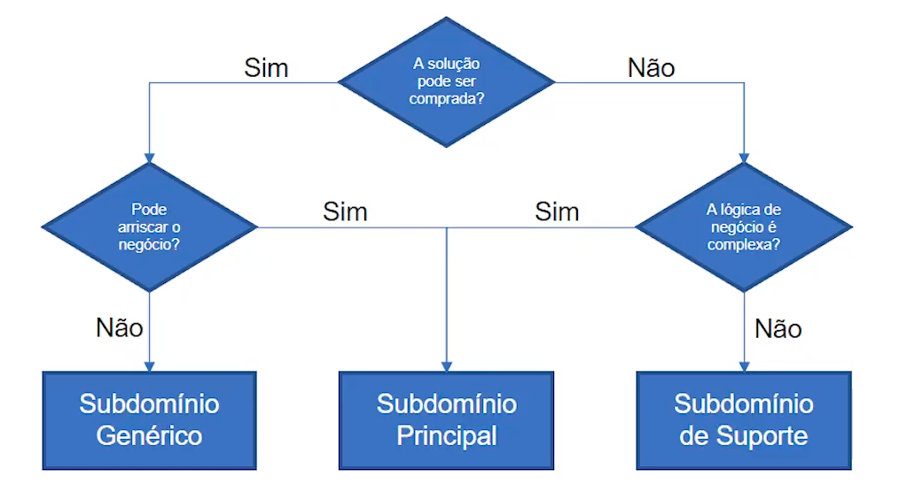

# Introdução à Domain Driven Design

Uma introdução sobre o cenário que vamos tratar nesta aula que é uma Escola XPTO muito inovadora. Buscando uma ferramenta que suporte o seu modelo. 

Nós como desenvolvedores devemos refletir o que o contratante está desejando para criar uma solução que atenda. 

### Desafios de Projetos de Software
1. Falta de clareza nos objetivos
2. Scope Creep *(aquela pessoa que ta sempre trazendo algo novo, uma mudança de direção)*
3. Expectativas Irreais
4. Recursos Limitados
5. Falha na Comunicação *(Uma das coisas que o DDD ataca fortemente, precisamos no comunicar muito bem para ter sucesso no projeto)*
6. Atraso nas Entregas
7. Falta de Transparência

```
"O conhecimento do negócio nunca é centralizado, times de desenvolvimento precisam balancear e priorizar as necessidades e requisições de negócios de múltiplos membros do time além de se engajar com diversas pessoas que possuem habilidades muito distintas, tudo isso com o objetivo de descobrir os requerimentos funcionais e não funcionais do software."
Vernon, Vaughn
```

### Qual o Domínio da Escola ?

O domínio da escola primária é a **educação**. Tendo DDD como uma ferramenta para criar essa solução, devemos atacar principalmente no coração do negócio, que neste caso da primeira aula é a **educação**

### Domínio

Me parece que o Domínio de uma empresa é dividido nas seguintes partes:
1. **Subdomínio Principal:** É a razão da empresa existir e é aquilo que diferencia o seu negócio de todas as outras empresas do mercado, é o que faz o seu cliente comprar de você e não do concorrente. 
2. **Subdomínio Genérico:** É aquele domínio que toda empresa tem que ter e que são cruciais para que a empresa não quebre, por exemplo, *folha de pagamento, funções de autenticação, portal da empresa, loja online, etc..*
3. **Subdomínio Suporte:** Apoia o negócio da empresa, não dá vantagem estratégica para o negócio mas complementa o que o **subdomínio principal** faz.

### Exemplo 

```java
/*
    Aqui o pessoal do marketing sugeriu que o "lead" são pessoas que eles estão tentando alcançar para fazer admissão
*/
class Marketing {
    private int id_lead;
    private String nome_lead;
}

/*
    Aqui o pessoal de admissões sugeriu que, aquilo que o pessoal de marketing chama de "lead", eles chamam de "prospect"
*/
class Admissoes {
    private int id_prospect;
    private String nome_prospect;
}
/*
    Então ta aqui o problema NO CÓDIGO de como a falta da comunicação e falta de implementação de DDD trás problemas. (: 
*/
```



### Quem nos ensina sobre os subdomínios?

Agora precisamos estar perto do famoso **Domain Expert** que DOMINA aquele subdomínio. Precisamos falar com quem ensina e quem administra, todos que possam nos dar uma visão de como tudo funciona. O Domain Expert é a pessoa que incialmente detectou a necessidade.