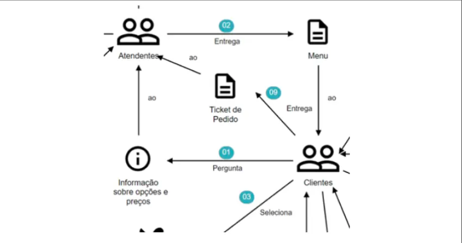
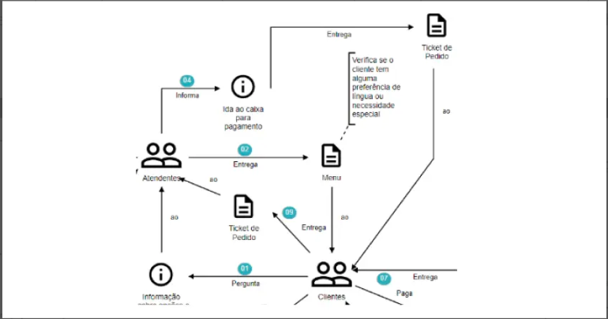
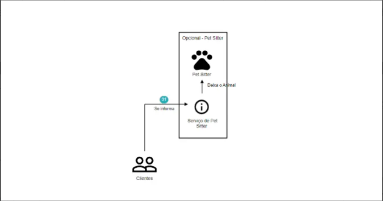
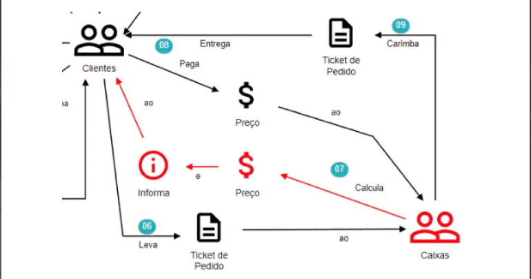

# Domain Storytelling

O Domain Storytelling é justamente a narrativa do domínio, é um conjunto de técnicas e métodos que utilizamos para identificar e entender melhor os domínios e subdomínios. Para isso trazemos pessoas com vários de níveis de conhecimento para compartilharem suas visões em um único documento. 
É uma técnica colaborativa que nos ajuda a entender como diferentes pessoas, com diferentes pontos de vista sobre o negócio, trabalham juntas. Isto é primordial para **modelar softwares**.

```
"Contar histórias ainda funciona na era do software. Em nossa experiência, contar e ouvir e histórias ajuda no seguinte: 
1 - Entender o domínio.
2 - Estabelecer uma linguagem entre os Domain Experts e os IT Experts.
3 - Evitar mal-entendidos.
4 - Esclarecer os requisitos do software.
5 - Implementar Software corretamente.
6 - Estruturar o software.
7 - Desenhar processos de negócio, suportados por software, que sejam viáveis."
(HOFER-SCHWENTER, 2021, P.31) - "Domain Storytelling: A Collaborative, Visual, and Agile Way to Build Domain-Driven Software"
```

## Linguagem Pictográfica

Para criar a narrativa do domínio de forma coesa e legível, precisamos de símbolos que representem objetos e conceitos, também precisamos de símbolos que estabeleçam conexão entre eles. Um pictograma nada mais é do que um símbolo que representa algo. Este é um exemplo que a FIAP está passando, porém, acredito que qualquer desenho sirva desde que respeite os seguintes conceitos: 


### Atores

Toda história possui seus atores, como fazíamos com a linguagem UML, necessitamos de um desenho que represente algo ou alguém que execute alguma função.


### Objetos de Trabalho

Os objetos de trabalho são utilizados pelos atores. Sejam eles documentos, objetos, interações físicas e digitais. Exemplos: 

```
    - Físicos: ticket de pedido, menú, telefone, etc..
    - Digitais: menu digital, ticket digital, etc..
    - Interações: um e-mail, uma ligação, etc..
```


### Atividades

Atividades são os símbolos que estebeleçem relações entre atores e objetos de trabalho, geralmente são representadas por setas SEMPRE nomeadas pelas ações que estão sendo tomadas.
Aqui tenho duas informações importantíssimas: 

1. Não existem representações condicionais em um pictograma, isso significa que cada condicional será tratada como uma nova história.
2. Também não devemos utilizar retornos (loopbacks) no mesmo fluxo. Com um pictograma queremos apenas contar uma história em que o intento do ator é de suma importância e não sua interação. Portanto devemos explorar técnicas tal como BPMN onde cada fluxo tem seu início e seu fim.


### Números Sequenciais

Toda história que se preze, além de ter um bom roteiro, segue uma sequência lógica. Portanto, a ferramenta Domain Storytelling também precisa de algo que nos guie por meio da história.



#### DISCLAIMER

Quando estivermos criando a história, temos que levar em conta que é o **Domain Expert** que conta a história, e podemos ter sequências lógicas vindo fora de ordem, o que demanda ajustar a numeração.

### Anotações

Como o próprio nome já diz, são anotações que fazemos ao documentar a história. Estas anotações contêm informações importantes, tais como limitações naquela atividade, ações que devem ser tomadas, gatilhos para outros processos ou eventos etc.



### Grupos

São representações partes de uma história. Por exemplo, ações que são repetidas constantemente, subdomínios, limitações do processo, etc. Grupos são representados por linhas de limite no nosso design, tal como mostrado abaixo:



### Cores

Muitas vezes podemos utilizar cores para trazer ênfase à uma série de atividades, destacando assim uma particularidade, tal como é possível observar abaixo: 



## Cenários

Como vimos anteriormente, a linguagem pictográfica nos dá uma base de como podemos interpretar o que o usuário está nos dizendo, criando assim uma linguagem única que demostra o fluxo da história, seus atores, objetos e atividades. Porém, toda boa história, além do seu caminho principal, tem suas devidas variações.

### Escopo

Sempre que falamos de escopo, pensamos em algo definido, ou seja, que tem seu começo, meio e fim. Porém, isso não quer dizer que não tenhamos variações dentro desse processo e limitações.

Muito bem! E até onde eu devo ir com as histórias? De acordo com Cockburn (2001), o nosso nível aceitável seria o nível do mar, ou seja, objetivos do usuário até o nível da ostra. Por exemplo: se você já foi longe demais para a história, não quer dizer que mais tarde você não irá mais fundo.

## Realidade vs Desejo

Falamos de ouvir e escrever a história do usuário, porém, temos que nos lembrar que uma história pode ter muitas versões. Aqui é importante ouvir todos os Domain Experts, consolidar o que estamos ouvindo e entender se o que estamos mapeando é algo real, ou seja, o que acontece hoje. **Ou se o Domain Expert está nos contando o que deseja que seja feito.**

Mapear histórias é desenhar um processo para que seja criada uma solução. Quando ouvimos o nosso Domain Expert, ele pode nos contar uma história, tal como a vê, de acordo com o seu dia a dia. Esta é a realidade do usuário.

**PORÉM, TAL COMO DIRIA HERÁCLITO DE ÉFESO: “NINGUÉM ENTRA EM UM MESMO RIO UMA SEGUNDA VEZ, POIS, QUANDO ISSO ACONTECE JÁ NÃO SE É O MESMO, ASSIM COMO AS ÁGUAS QUE JÁ SERÃO OUTRAS (SUPERINTERESSANTE, 2022)**

A frase acima pode ser usada para entender a mente do nosso ou da nossa Domain Expert, pois, ao descrever a história, a pessoa pode realizar uma autocrítica e já pensar em novas formas de como realizar aquela tarefa ou processo. Com isso, temos duas histórias: uma que é a nossa realidade atual (AS IS) e a nova realidade ou futura (TO BE).

*Vale ressaltar aqui que a solução que vamos criar não “nascerá” imediatamente com a nova realidade, mas pode ser algo que será implementado no futuro, no desenrolar do desenvolvimento. Isso pode ser melhor desenhado utilizado metodologias ágeis, por exemplo.*

## Equipe de Trabalho
Agora que mapeamos a história, vamos para o próximo passo, colocar em prática. Como pessoas desenvolvedoras, não temos conhecimento do que virá, ou seja, qual a história do Domínio, então precisamos montar um time que nos ajudará com essa tarefa.

O passo mais importante agora é selecionar as “pessoas certas” para a integrarem o time, pessoas que têm relação com Domínio, pessoas que vão contribuir com a história.

Uma sugestão de time é a seguinte:
- **Domain Experts:** quantos forem necessários para contar a história
- **Ouvintes:** todos que estão dispostos a aprender sobre a história, normalmente o time de desenvolvimento e mais alguns agregados.
- **Moderador:** que vai conduzir as conversas, criando as lógicas de perguntas e mantendo o assunto alinhado com o que se quer atingir.
- **Modelador:** que vai criar a história em linguagem pictográfica e fazer as devidas anotações.