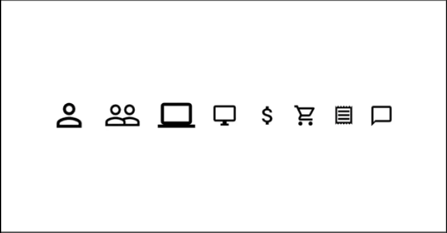
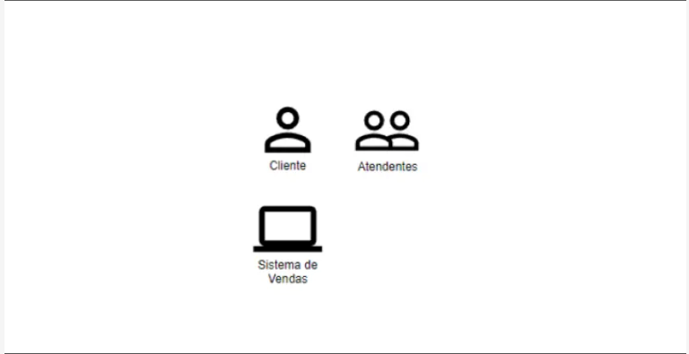
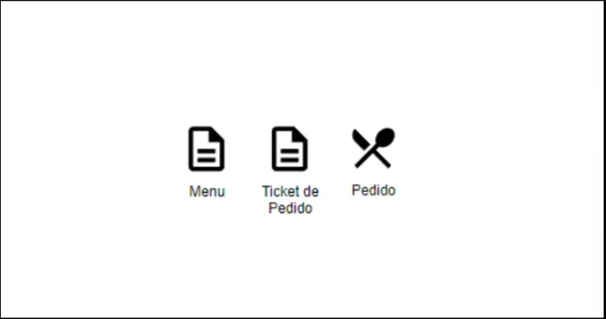
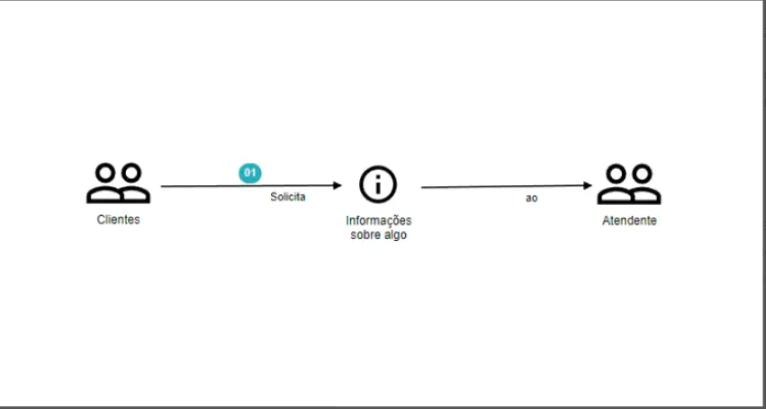

# Domain Storytelling

O Domain Storytelling é justamente a narrativa do domínio, é um conjunto de técnicas e métodos que utilizamos para identificar e entender melhor os domínios e subdomínios. Para isso trazemos pessoas com vários de níveis de conhecimento para compartilharem suas visões em um único documento. 
É uma técnica colaborativa que nos ajuda a entender como diferentes pessoas, com diferentes pontos de vista sobre o negócio, trabalham juntas. Isto é primordial para **modelar softwares**.

```
"Contar histórias ainda funciona na era do software. Em nossa experiência, contar e ouvir e histórias ajuda no seguinte: 
1 - Entender o domínio.
2 - Estabelecer uma linguagem entre os Domain Experts e os IT Experts.
3 - Evitar mal-entendidos.
4 - Esclarecer os requisitos do software.
5 - Implementar Software corretamente.
6 - Estruturar o software.
7 - Desenhar processos de negócio, suportados por software, que sejam viáveis."
(HOFER-SCHWENTER, 2021, P.31) - "Domain Storytelling: A Collaborative, Visual, and Agile Way to Build Domain-Driven Software"
```

## Linguagem Pictográfica

Para criar a narrativa do domínio de forma coesa e legível, precisamos de símbolos que representem objetos e conceitos, também precisamos de símbolos que estabeleçam conexão entre eles. Um pictograma nada mais é do que um símbolo que representa algo. Este é um exemplo que a FIAP está passando, porém, acredito que qualquer desenho sirva desde que respeite os seguintes conceitos: 



### Atores

Toda história possui seus atores, como fazíamos com a linguagem UML, necessitamos de um desenho que represente algo ou alguém que execute alguma função.



### Objetos de Trabalho

Os objetos de trabalho são utilizados pelos atores. Sejam eles documentos, objetos, interações físicas e digitais. Exemplos: 

```
    - Físicos: ticket de pedido, menú, telefone, etc..
    - Digitais: menu digital, ticket digital, etc..
    - Interações: um e-mail, uma ligação, etc..
```



### Atividades

Atividades são os símbolos que estebeleçem relações entre atores e objetos de trabalho, geralmente são representadas por setas SEMPRE nomeadas pelas ações que estão sendo tomadas.
Aqui tenho duas informações importantíssimas: 

1. Não existem representações condicionais em um pictograma, isso significa que cada condicional será tratada como uma nova história.
2. Também não devemos utilizar retornos (loopbacks) no mesmo fluxo. Com um pictograma queremos apenas contar uma história em que o intento do ator é de suma importância e não sua interação. Portanto devemos explorar técnicas tal como BPMN onde cada fluxo tem seu início e seu fim.

