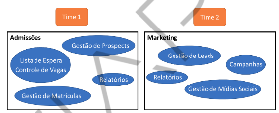

# Descoberta e formação do conhecimento

Nesta aula falamos mais sobre o domínio do negócio e para isso vamos conhecer aqui agora sobre a **linguagem ubíqua**, **contextos delimitados** e, claro, quais são as ferramentas que vão nos ajudar nisso. Aqui aprendemos a nos comunicar com o cliente e a documentar o nosso código. 
O maior desafio deste momento é conhecer e falar o negócio, estar por dentro e conseguir conversar de igual para igual com pessoas do negócio.

## Linguagem Ubíqua

A linguagem ubíqua significa que falemos todos o mesmo idioma, tenhamos o mesmo glossário, para que o código reflita as conversas que temos com o time de negócios. Então o importante deste conceito é tentarmos aprender aquilo que é a linguagem comum utilizada no dia a dia das pessoas do negócio, e para isso temos que conhecer muito bem os **cenários** do negócio, aqueles que desenhamos juntamente com os Domain Experts no **Domain Storytelling**.

### Termos Ambíguos

Dentro de um subdomínio, podemos ter um mesmo termo com vários significados. Por exemplo: política. Esse termo pode significar uma lei regulatória ou uma regra interna da escola. Como em linguagem ubíqua precisamos de uma definição para cada termo, aqui podemos definir que o termo política será utilizado para os dois significados.

### Termos Sinônimos

Dentro de um subdomínio, podemos ter um termo que é utilizado para vários significados que possuem muito mais detalhes. Por exemplo, em TI utilizamos sempre o termo login para referenciar o ato de efetuar autenticação no sistema, ou para referenciar a conta do usuário. É importante notar que são coisas totalmente diferentes que alocamos o mesmo nome por conveniência. Em linguagem ubíqua, sempre que possível, temos que quebrar esses termos e lhes dar definições únicas e específicas para evitar problemas futuros.

## Modelagem de Domínio

Para criar um modelo do **Domínio** estamos tentando desenhar uma abstração de um processo que resolve um problema do negócio. Então ao modelar um domínio precisamos extrair apenas o **essencial** para que o problema seja **resolvido**.

# Encaixando as Peças

## Contextos Delimitados

Identificamos o domínio e seus subdomínios, como cada um *“participa”* do negócio e qual a sua parte na estratégia da empresa.  Pois bem, agora começamos a criar limites para a nossa solução, limites que não são definidos pelos subdomínios. Esses limites existem dentro de contextos que identificamos ao analisar o negócio, são o que chamamos de **Contextos Delimitados (Bounded Contexts)**.

Observações importantes sobre esta definição: 
- **Não há regra para definir o tamanho do contexto**: Tudo vai depender da análise do Arquiteto de Software e principalmente da linguagem ubíqua, de como as pessoas do negócio conversam naquele contexto. O termômetro para saber se está no caminho certo sempre será a **linguagem ubíqua**. Se as pessoas daquele contexto estão usando terminologias ou tratando processos de forma muito distintas, são contextos diferentes.
- **A quantidade de recursos não é fixa**: Depende do tipo de projeto que você está trabalhando. O tamanho do contexto pode ajudar, **mas lembre-se** que não é porque o contexto é grande que o time precisa ser também. Se o projeto tiver muitas dependências, não adianta tentar paralelizar pois vai acabar não acelerando nada.
- **O número de contextos pode mostrar o número de times** que farão parte da equipe de desenvolvimento, mas como vimos acima, podemos  refinar sucessivamente nosso modelo e ir integrando cada vez mais nossos contextos, diminuindo assim a quantidade.
- **Podem existir casos de contextos delimitados** que englobem a solução inteira, se a solução for muito pequena isso é possível, assim como podemos ter contextos delimitados em que não haverá agrupamento de contextos e será 1 para 1, no caso de sistemas muito grandes e complexos.

Na figura abaixo podemos ver claramente que o **Time 1** está responsável por 4 **Contextos Delimitados**. Estes contextos foram mapeados para o **domínio** de Admissões da escola. E na imagem fica aberto para interpretação se estes contextos são referentes à aplicações completamente separadas (microsserviços) ou até mesmo uma única aplicação (monolíto) que trata estes processos de negócios.

