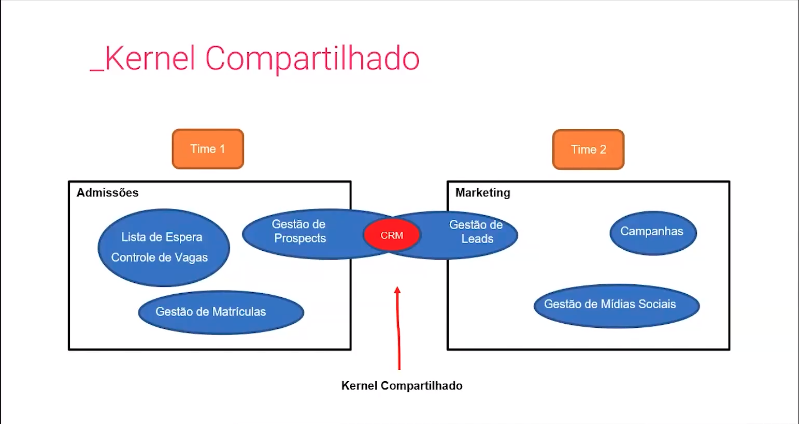
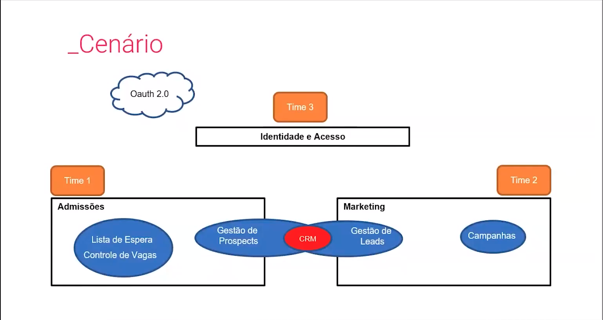
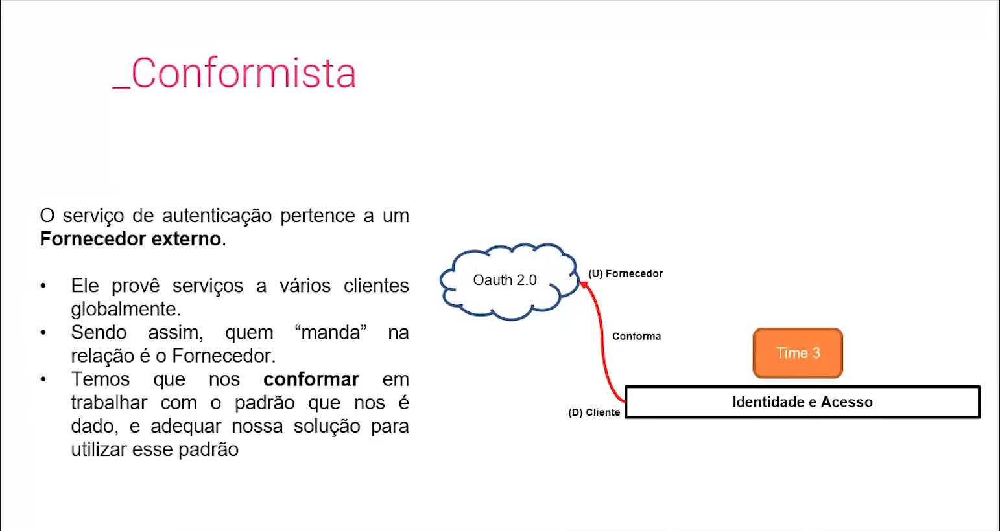
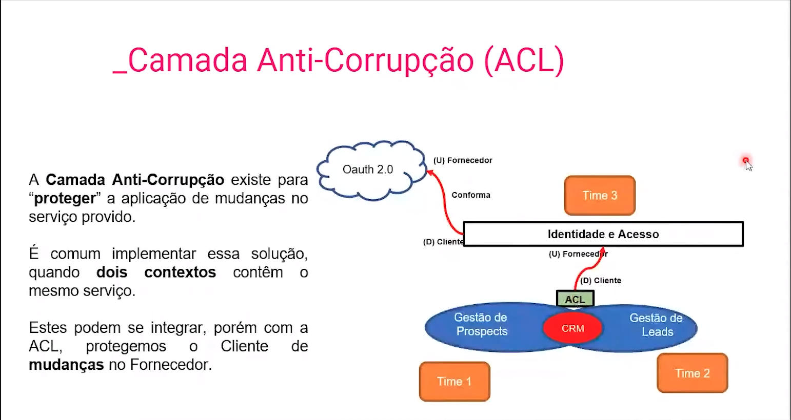
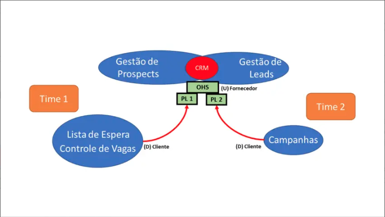
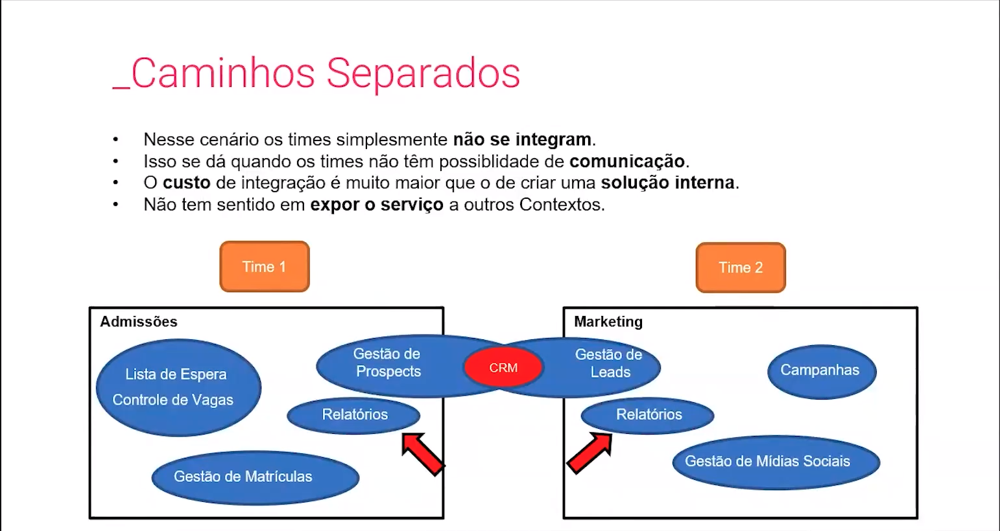
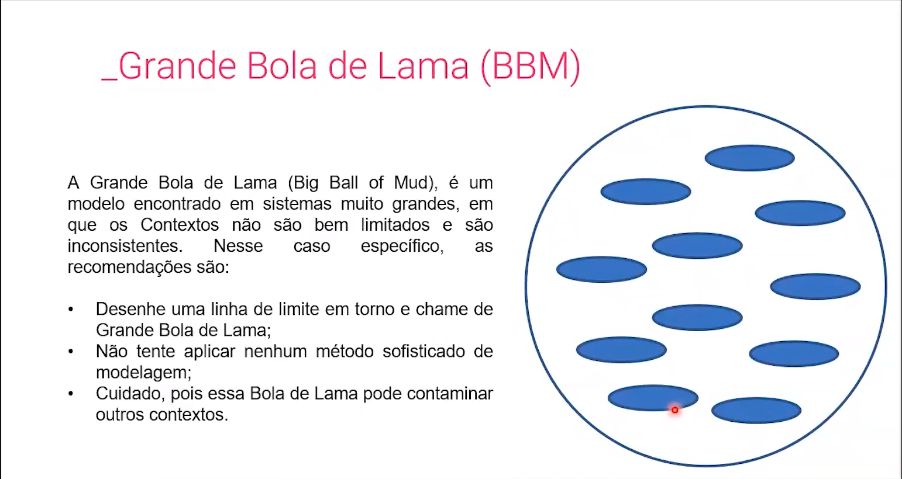
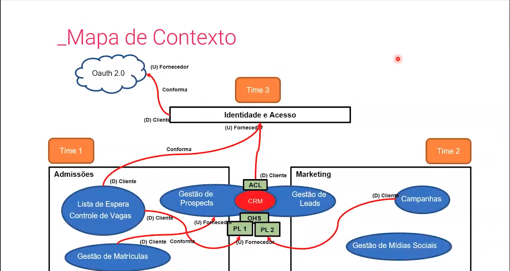

# Trabalhando com Contextos Delimitados

Agora que já sabemos o que são os **bounded contexts**, veremos como trabalhar com eles, o modo de trabalho dos times, quais as limitações e o uso de cada caso. 

```
Lembrando do nosso projeto escola, imagine que nosso time de desenvolvimento precisa trabalhar com vários contextos. Por exemplo, temos o contexto de admissões, de marketing e autenticação. Cada time trabalhando com seu contexto delimitado, como vimos na aula anterior. Mas como realizar a integração entre esses vários contextos? Temos diversas formas de integração. Quais são elas e quais os cenários que ela melhor se aplica? E quando temos um sistema legado? Como ele pode ser integrado a todo esse cenário?
```

O negócio não vive por conta de um único contexto, e sim de vários e de suas **integrações**. Dado que, cada contexto delimitado será feito por um time ao mesmo tempo, e isso requer disciplina de comunicação e entendimento do que está sendo feito, pois a integração é a chave de todo o processo de negócios.

## Cooperação

Vão haver alguns casos onde a comunicação é **CLARA** e **OBJETIVA** entre os times e não existe precedência de um contexto a outro, tendo assim uma colaboração total entre os times.

## Parceria

Neste modelo de cooperação a comunicação flui constantemente e os times se notificam sobre mudanças que estão ocorrendo, compartilhando documentações e sempre em integração. E é importante ressaltar que a comunicação é MUITO frequente e mudanças serão normais, principalmente nos primeiros momentos.

## Kernel Compartilhado

Neste modelo de cooperação temos uma parte do modelo que é comum a todos os contextos envolvidos e deve seguir as definições funcione para todos. 
Durante a aula é bem explícito que este modelo de cooperação entre os times é uma exceção e não uma regra, ou seja, deveríamos ao máximo evitar este tipo de modelo, porém, aparentemente acontece na maioria das empresas e é super normal encontrar isso em produtos atualmente ahahahah. 
Os próprios professores citaram pelo menos 2 exemplos deste em produção na experiência deles, já o de **Parceria**, eles não comentaram muita coisak

No exemplo da aula temos o seguinte exemplo: 



## Cliente - Fornecedor

Neste modelo segundo o Eric Evans no livro DDD temos: 

- Fornecedor **(Upstream)**: provê um serviço.
- Cliente **(Downstream)**: consome um serviço.

Existem casos onde um time acaba dependendo de um serviço externo.

No cenário da aula temos este cenário onde além dos times que estão trabalhando com kernel compartilhado, temos também um terceiro time *(ou terceiro contexto delimitado)* que cuida da parte de identidade e acesso da escola. Este terceiro time, no cenário em questão, seria um **Downstream** *(ou cliente)* de um **Upstream** *(ou fornecedor)* que está provendo serviços de login e/ou autenticação *(login com google, facebook, etc.)*



### Conformista

Eric Evans em seu livro DDD, vai chamar este time de **Conformista**, pois este time escolheu um fornecedor para utilizar os serviços e ele não necessariamente conhece a equipe do fornecedor, sendo assim, quem manda nessa relação **é o fornecedor** e o time tem que apenas se conformar e se adequar ao funcionamento do serviço provido.



### Anti-Corruption Layer

Recapitulando para fazer sentido então: 
- **Time 1 & Time 2:** Trabalham em contextos diferentes e cooperam entre si através do modelo chamado pelo Eric Evans de **Kernel Compartilhado** pois a eles têm parte do sistema de CRM em conjunto. 
- **Time 3:** Trabalha em um contexto delimitado específico chamado de Identidade e Acesso no modelo de **Cliente-Fornecedor** e vimos até aqui que ele é o **Cliente** de um provedor de OAuth 2.0.

Neste modelo ACL vamos mostrar agora o **Time 3** sendo também o **Fornecedor** de um outro tipo de cooperação & integração de contextos delimitados para poder introduzir este tema de ACL.



Em cenários onde o Downstream depende somente de informações específicas do serviço de Upstream, o contexto delimitado é muito diferente e precisamos nos proteger contra possíveis mudanças no contrato do Upstream cria-se o sub-modelo de integração *(que faz parte do modelo de Cliente-Fornecedor)* chamado **ACL**. 

É criada então uma camada de anti-corrupção que integra com o serviço do Upstream e faz as transformações necessárias e provê somente as informações necessárias para os contextos delimitados *(que neste caso, são os contextos de Gestão de Prospects e Gestão de Leads compartilhando o Kernel CRM)* com a finalidade de proteger os contextos delimitados de falharem em caso de alterações nos contratos.

Cenários recomendados de uso de ACL: 
- Quando o contexto Cliente (D) contém um subdomínio principal. Isso evita 
que  se  corrompa  ou  interfira  na  implementação  da  solução  principal, 
isolando os códigos.
- Quando o modelo do fornecedor (U) é ineficiente ou não serve totalmente ao cliente. Nesse caso usamos ACL para filtrar somente o que é necessário - solução muito utilizada em caso de integração com legados.
- Quando o fornecedor (U) muda constantemente seu protocolo, o que aumenta a complexidade da solução. Tendo uma ACL, a manutenção fica apenas nesse código.

### Open-Host Service (OHS) & Published Language

É um sub-modelo de integração debaixo do modelo **Cliente-Fornecedor**, pensando nos casos onde o fornecedor tem o controle da solução e "força" o cliente a se adaptar à sua realidade, mas e quando o cliente tem a preferência na integração? Agora o fornecedor provê uma camada de integração onde expõe seus serviços para que o cliente não precise se adequar mas sim **utilizar** algo padronizado e que não muda com o tempo. 

Já o sub-modelo de linguagem publicada é quando além do fornecedor prover o seu serviço aberto, ele também provê uma abstração a mais que será chamada de linguagem utilizada pelo cliente. Dessa forma, o fornecedor consegue desenvolver a sua solução internamente sem afetar seus clientes e mantém diversas versões **personalizadas** de linguagem, mantendo seu protocolo aberto e não impacta o cliente. Exemplos: 

- Mercado financeiro, com bancos, adquirências (Stone, Cielo, Rede, etc.)
- Mercado Logístico, Transportes (integração de documentos de transporte), controle de estoque.



## Caminhos Separados

Depos de muuuuuito tempo vendo só o modelo de Cliente-Fornecedor e seus submodelos... vemos um outro modelo de integração! 
Neste modelo os times simplesmente não se integram. Isso acontece quando os times não têm possibilidade de comunicação, o custo de integração é maior do que criar uma outra solução interna, e não tem sentido em expor o serviço a outros contextos.



## Big Ball of Mud

Teste



# Mapa de Contexto

Por fim, depois de mapear todos os seus contextos delimitados e suas devidas integrações: 

Lembrando que este mapa de contexto é VIVO e nunca estará de fato pronto! Cada alteração que for feita é uma documentação que vamos precisar manter.

