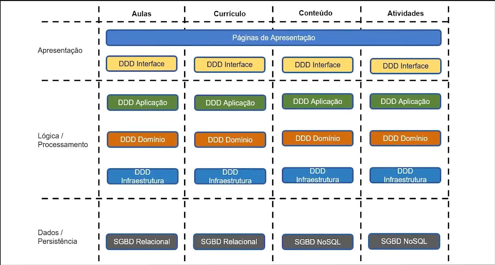
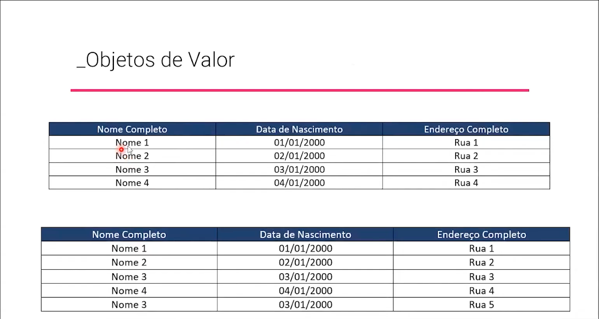

# Implementando Arquitetura e Lógica

Segundo a pós graduação, até aqui falamos sobre "o que" e "por que" fazer um design de software, e daqui em diante vamos falar sobre "como" fazê-lo, e isso se dará por meio de padrões que refletem o que vimos até agora. **Hora de materializar o que vimos até aqui.**

## Design Tático

É neste momento que vamos falar sobre **Arquitetura** e **Blocos de Construção** do DDD, aqui vamos discutir as bases do nosso sistema, definindo quais tecnologias utilizar *(por exemplo: bancos relacionais ou NoSQL? microsserviços ou barramento de serviço?)* e como elas interagem entre si. 

## Arquitetura

Chegou a hora! O DDD sugere a organização da nossa arquitetura em 3 camadas. 

### Interfaçe de Usuário

Essa é a camada que contém a Interface do usuário (GUI), interfaces de linha de comando (CLI) e APIs para integração com outros sistemas.

### Aplicação

Esta camada não é exatamente sugerida pelo DDD, porém, ela é muito citada nas literaturas relacionadas ao DDD. 

Portanto essa camada não contém lógica de negócio, não altera estado de objetos mas sim monitora e reporta essas mudanças a camada superior

### Domínio

**O coração do software** segundo Eric Evans. Essa é a camada que contém todos os conceitos do negócios, onde estão todas as regras de negócio. É nessa camada que a lógica de negócios é executada, as mudanças de estado acontecem e os registros e afins são criados. 

Essa camada NÃO armazenadados, mas provê as devidas informações para serem registradas à camada de infraestrutura.

### Infraestrutura

Essa é a camada que possui as capacidades técnicas de suporte às camadas superiores. Aqui existem os meios de mensageria, persistência de dados e é utilizada como o padrão de interações entre as camadas (caso não haja integração direta entre elas).

Bom, agora seguimos na modelagem da nossa arquitetura né: 

E essa foi a sugestão dos nossos professores de DDD. 

## Blocos Fundamentais

Falando de como estruturar os objetos que serão criados nesta arquitetura, vamos entrar no DDD na parte de blocos fundamentais que são estruturas que nos orientam como proceder com a implementação. 

### Objetos de Valor (Value-Objects)

Geralmente reconhecidos porque não têm um ID, e na realidade utilizamos seus valores para distinguir um do outro. 
Cada um deles é único e imutável e possui as seguintes características: 

- Eles mensuram, quantificam, ou descrevem algo no domínio;
- Eles podem ser mantidos como imutáveis;
- Criam um modelo conceitual de integridade se compondo de todos os atributos como uma unidade;
- São completamente substituíveis quando uma medida ou descrição muda;
- Podem ser comparados uns aos outros por igualdade de valores;

Exemplo: 

Neste exemplo, o professor explicou que objetos de valor são considerados distintos se algum dos dados são distintos. Neste caso, na tabela debaixo, foi adicionado um novo registro do `Nome 3` porque o endereço completo é diferente. 

### Entidades (Entity / Reference Objects)

Ao contrário do objeto de valor, as entidades possuem **identificadores** e são objetos **mutáveis**, ou seja, cada um vai ter um ID único que nunca mais será utilizado por outros. Ao criar uma nova Entidade, diferente dos objetos de valor, não temos que verificar se seus valores já existem. Basta inserirmos, pois independente de existir ou não, teremos um novo identificador que aponta para esta nova entidade. 

Este identificador é essencial para rastrear a entidade enquanto ela percorre varios estados, talvez sendo persistida numa base de dados e depois buscada, enquanto possivelmente passa por mudanças de estado em seu "ciclo de vida".

### Agregados (Aggregate)

Os agregados é um conjunto de entidades e objetos de valor que mantém relacionamentos entre si e possuium limite que o circunda e define. 

Uma das premissas básicas de agregados é a consistência forçada, que garante a integridade de dados. Ou seja, somente a lógica do agregado pode alterar o seu estado e também garantir a consistência entre todas as entidades e objetos de valor que se relacionam em conjunto.

Nenhum objeto fora do agregado pode alterar o seu estado. Entidades externas podem somente solicitar ao **agregado** que execute ações que alterem seu estado.

### Domain Services

Serviços de domínio são usados para representar operações, tarefas ou ações que são conceitos do domínio (regras de negócio) mas não se encaixam de forma natural no reino de Entidades nem de Objetos de Valor. Eles encapsulam lógica de domínio que não pertence a nenhuma Entidade ou Objeto de Valor. 

Os serviços de domínio são definidos por interfaces expostas para serem utilizadas pelas camadas mais acima, e a implementação destes serviços podem variar dependendo do seu negócio.

Domínios de Serviço são úteis para organizar lógica de domínio que nos levaria a ter Entidades ou Objetos de Valor muito inchados, coordenar as tarefas que envolvem múltiplos objetos de valor ou até mesmo para implementar operações que são parte intrínseca do domínio mas não se encaixam em Entidades ou Objetos de Valor.

#### Critérios para identificar serviços de Domínio: 

- A operação é relacionada a um conceito do domínio que não se encaixa perfeitamente em nenhuma Entidade nem em um Objeto de Valor;
- A operação envolve interagir entre múltiplas Entidades e Objetos de Valor;
- A operação tem efeitos colaterais que não são adequados para serem colocados dentro de uma Entidade ou um Objeto de Valor;
- Geralmente operam em estados de Entidades mas o **Domínio de Serviço** em si, não tem um estado

