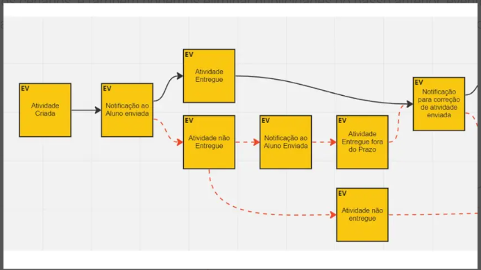
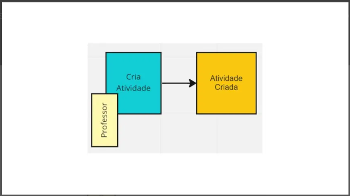

# Event Storming

Nessa aula começamos a modelar o nosso negócio *(lembrando que o projeto prático proposto pela faculdade até este momento é UMA ESCOLA)* utilizando a ferramenta do chamada de **Event Storming** ou em português seria a **Tempestade de Events**, ferramenta essa que foi criada posterior a obra original de DDD.

É uma atividade lúdica, onde um grupo diverso de pessoas se reúne e modela o processo de negócio. Bem parecido com o que vimos em domain storytelling. A intenção aqui é usar elementos e recursos simples para desenhar/mapear processos de negócios/objetos, e neste caso cartões coloridos funcionam bem demais. 

Para começar precisamos de: 
- Domain Experts.
- Ouvintes.
- Facilitador - geralmente quem conduz a conversa.

Como começamos? 

## 1 - Brainstorming

Tudo começa com a galera criando e jogando na tela todos os **eventos** que aconteceram referente a um processo do negócio.

Importante nesta etapa aqui tudo ser escrito **no passado** e **a ordem das coisas não importa** aqui também. Estamos tentando esgotar as ideias e as memórias também. Que dure o tempo necessário.

## 2 - Linha do Tempo

Depois de ter um quadro cheio de eventos, vamos remover os duplicados, revisá-los e seguimos para esta etapa que é: colocar todos os eventos em ordem cronológica assim como acontece no **processo de negócio**.

Neste caso aqui é um desenho do que seria o "caminho ideal", ou seja, quando tudo segue o caminho que deveria. Quando acontecem as execeções a gente trata e desenha elas como um "caminho alternativo" na linha do tempo... sem condicionais.

## 3 - Pontos de Atenção 

Com todos os eventos organizados cronológicamente temos uma visão do processo de negócio e aí podemos começar a criticá-lo, ou seja, verificar onde estão os pontos de atenção, dúvidas, como cada passo é feito, se necessitam de mais documentos ou se temos algum gargalo. 

Nesta etapa começamos a ver um post-it de outra cor para representar algo diferente no nosso **Event Storming**. Colocamos aqui os pontos de atenção com **LOSANGOS**.

## 4 - Eventos Pivotais

Ao longo da linha do tempo, vamos notar que alguns eventos vão indicar uma **troca de fase**, ou uma **mudança de contexto**.. estes eventos são o que chamamos de **Eventos Pivotais**. Eles mudam como vamos operar e são marcados por meio de **linhas verticais** em nossa linha do tempo. 

Um ponto importante é que os eventos pivotais são importantes indicadores de **contextos delimitados**, porém, a nível de processo de negócio e não mais a nível do céu/organização/macro.

## 5 - Comandos

Até agora nossa linha do tempo representa todos os eventos e as nossas preocupações sobre os eventos. Porém, os eventos aconteceram por alguma ação que foi tomada por um ator. Essas ações são denominadas **Comandos** e são escritas no imperativo.

- Criar Atividade (ator: Professor).
- Corrigir Atividade (ator: Professor).
- Realizar Atividade (ator: Aluno).

Os atores/políticas/lógicas aparecem ao lado dos comandos. Os comandos são inseridos na nossa linha do tempo utilizando posts azuis, e os atores são um pequeno papel amarelo ccom tonalidade diferente.

## 6 - Políticas

Alguns comandos não são realizados por atores mas sim por automações do sistema. Nesses casos, chamamos de **políticas de negócio**, que são utilizadas para disparar um comando e gerar um evento. 

As políticas ficam conectadas a eventos que as ativam e a partir dela o comando é gerado. **Políticas são representadas em nosso modelo por um post roxo**.

**PONTO IMPORTANTE**: Algumas políticas podem estar condicionadas à um critério limitante, ou seja, aquela política só será **ativada** CASO o evento anterior atenda uma condição. 

## 7 - Modelo de Leitura

Modelo de leitura é utilizado para representar a **visão dos dados**, que podem ser relatórios, telas, e-mails, notificações etc., que os atores vão utilizar para tomar uma decisão antes de executar um comando. 

No nosso exemplo, são utilizados posts verdes para representar o modo como o ator visualiza os dados para tomar a decisão de executar um comando, e são posicionados ANTES de um comando. 

## 8 - Sistemas Externos

Em diversos casos, podemos ter ações ou eventos que podem vir ou ir para sistemas externos ao que estamos desenvolvendo. Sistemas externos estão além do processo de negócios e do domínio que estamos explorando, portanto, com o Event Storming, representamos eles em posts ROSA.

Depois de todos estes passos vamos ter uma **linha do tempo** bem bonita e completa de como funciona todo este processo que mapeamos e com todos os elementos devidamente posicionados. Mas parece que está faltando um elemento do DDD muito importante não é mesmo? 

## Agregados

Por mais que tenhamos uma visão completa do processo, precisamos dar mais um último passo: organizar os nossos comandos e também os eventos que produzem em agregados.

Um ponto muito bom inicial é identificar os eventos pivotais, assim identificamos qual é o objetivo principal de cada passo que temos. 

## Contextos Delimitados

Por fim, separamos neste processo de negócio, os contextos delimitados que existem. 

