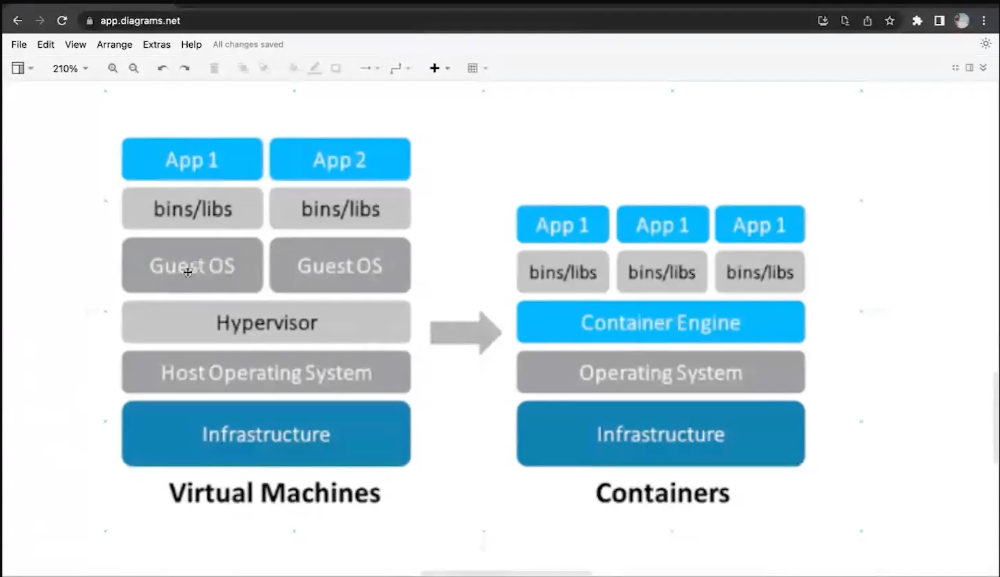

# O que é Docker

Começamos uma nova fase da pós graduação e aqui o objetivo é falar sobre Docker, containers e virtualização. Vamos entender como funciona a ferramenta que facilita muito o nosso ambiente de desenvolvimento, como também a publicação das nossas aplicações em ambiente de produção.

# Conceito

O docker veio para resolver aquele famoso meme da área da tecnologia que é o "na minha máquina funciona". O Docker é um sistema de containers, compartilhando o kernel do sistema operacional da nossa máquina *(host)*, mas mesmo assim, é uma camada de **Container Engine** que isola cada container que está sendo executado, garantindo que arquivos e processamentos são sejam compartilhados como outros containers, tornando a execução s egura para sistemas e aplicações produtivos. 

Outra vantagem dos containers é que não precisamos rodar um sistema operacional completo, eles são mais leves que **ambientes virtualizados** e iniciam mais rapidamente. Isso permite que você possa executar mais serviços com uma mesma máquina. 



Basicamente nesta aula os professores explicaram o conceito de container versus o conceito de virtualização, instalaram o docker e mostraram alguns comandos básicos do docker. 

```bash
## IMPORTANTE, O COMANDO 'MAN' DO BASH SEMPRE NOS DARÁ UM MANUAL SOBRE
## AQUELE COMANDO QUE ESTAMOS PESQUISANDO E QUALQUER COMANDO QUE QUISERMOS 
## NOS APROFUNDAR É SÓ ADICIONAR A FLAG '--help' NO FINAL

# manual do docker
man docker

# a versão do docker
docker version

# mostra todos os containers ligados
docker ps 

# mostra todos os containers completos
docker ps -a

# cria um container do ubuntu na sua última versão & entra no modo iterativo do container que subimos
docker run -it ubuntu:latest /bin/bash 

# cria um container com um nome específico para facilitar os comandos no nosso container
docker run --name ubuntu -it ubuntu:latest /bin/bash

# para excluir por completo o container
docker rm <container-id> 
docker rm <container-name>
```